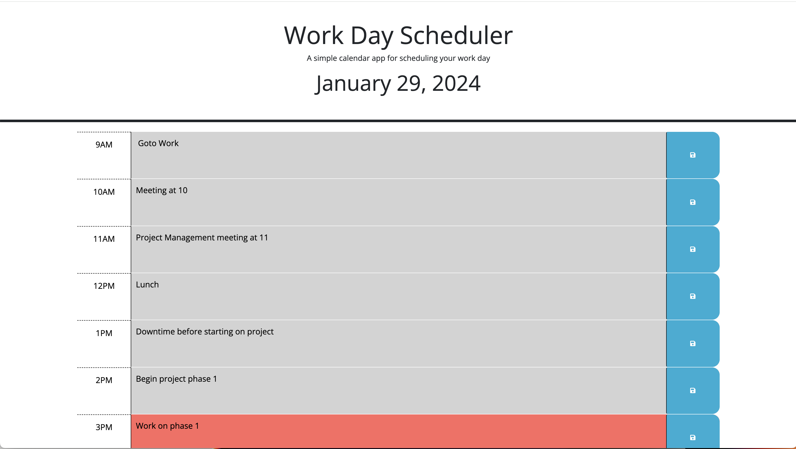

# Work Day Scheduler

## Overview
The Work Day Scheduler is a simple, dynamic calendar application designed to help employees manage their busy schedules effectively. It allows users to save events for each hour of a typical working day, from 9 AM to 5 PM. Built using HTML, CSS, and jQuery, this app features a user-friendly interface with dynamically updated content.

This application utilizes the [Day.js](https://day.js.org/en/) library for date and time manipulation, ensuring accurate and up-to-date scheduling.

## User Story

AS AN employee with a busy schedule
I WANT to add important events to a daily planner
SO THAT I can manage my time effectively


## Acceptance Criteria

GIVEN I am using a daily planner to create a schedule
WHEN I open the planner
THEN the current day is displayed at the top of the calendar
WHEN I scroll down
THEN I am presented with timeblocks for standard business hours of 9am–5pm
WHEN I view the timeblocks for that day
THEN each timeblock is color coded to indicate whether it is in the past, present, or future
WHEN I click into a timeblock
THEN I can enter an event
WHEN I click the save button for that timeblock
THEN the text for that event is saved in local storage
WHEN I refresh the page
THEN the saved events persist


## Features

- **Dynamic Date and Time Display**: The current date is prominently displayed at the top of the calendar, and it updates in real-time.
- **Interactive Time Blocks**: Time blocks for each hour allow users to input and view events. Each block changes color based on whether the time is in the past, present, or future.
- **Local Storage Integration**: User input is saved to local storage, ensuring that data persists even after refreshing the page.
- **Responsive Design**: The application is fully responsive, providing a seamless experience on both desktop and mobile devices.

## Screenshots

- 
- 

## Live Application

Access the live application here: [Work Day Scheduler](https://mbarrie1979.github.io/Work-Day-Scheduler/)

---

### Code Snippets

The application's functionality is powered by jQuery and Day.js. Below are key sections of the JavaScript code:

```html
<!-- HTML structure showing a sample time block -->
<div id="9" class="row time-block">
  <!-- ... other time blocks ... -->
</div>
